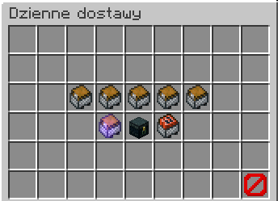

# Dostawy
Tutaj możesz odebrać darmowe dostawy.

## Gdzie znajde NPC'ta z dostawami:

Na głównym lobby na środku znajduje się ten NPC

Po kliknięciu otworzy się gui z dostawami.

## Krótkie informacje o dostawach
- Menu dostaw możesz otworzyć klikając NPC na lobby (opisane wyżej) lub pod komendą "/dostawy".
- Czym wyższą rangę płatną posiadasz, tym więcej dostaw możesz odebrać jednego dnia.
- Aby odebrać dostawe będziesz musiał wbić jednorazowo 900 expa każdego dnia.
- W trakcie trwającego eventu na serwerze dostępna jest dodatkowa specjalna dostawa.

## Ilość dostaw w zależności od rangi

| **Ranga** | **Ilość dostaw** |
|-----------|------------------|
| GRACZ     | 1                |
| VIP       | 2                |
| SVIP      | 3                |
| MVIP      | 4                |
| UVIP      | 5                |
| KOKS      | 6                |

## Co można dropnąć z tych dostaw?

1. Rubiny 
2. Exp'a
3. Uniwersalny klucz
4. Skrzynie (zwyczajną, pospolitą i rzadką)
5. Boostery doświadczenia lub rubinów
6. [Karma dla zwierząt](/article/ogolne/sluby#sluby)
