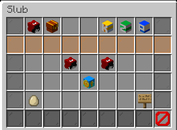
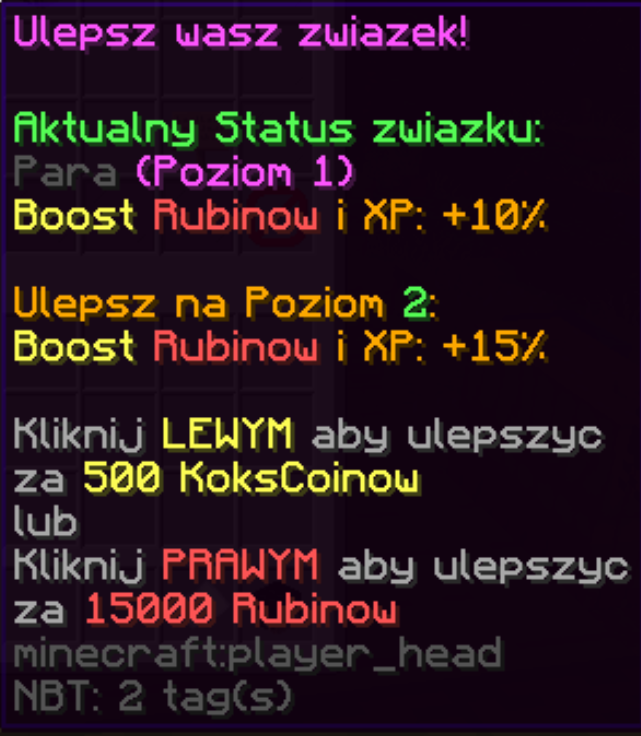
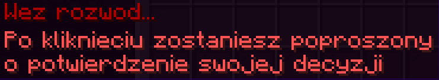
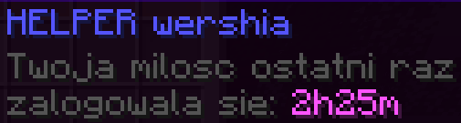
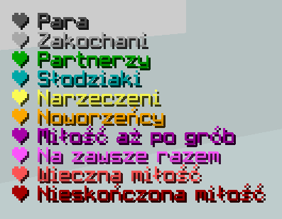

# Śluby
Na naszym serwerze można zawrzeć ślub z innym graczem. Związek można ulepszać maksymalnie do 10 poziomu. Im wyższy level, tym większy boost XP i rubinów otrzymujecie wraz ze swoją drugą połówką.

## Panel
- Związek można ulepszyć za kokscoiny **lub** rubiny:
  - Aby ulepszyć związek za **kokscoiny** kliknij **lewym** przyciskiem myszy na główkę w GUI.
  - Aby ulepszyć związek za **rubiny** kliknij **prawym** przyciskiem myszy na główkę w GUI.

    

- Aby wziąć rozwód kliknij **lewym** przyciskiem myszy na tabliczkę w GUI. Przed podjęciem ostatecznej decyzji zostaniesz poproszony o potwierdzenie.

    

- Aktualny status związku znajdziesz najeżdżając na główkę służącą do ulepszania ślubu.
- Czas od ostatniego logowania się twojej miłości sprawdzisz najeżdżając na jej główkę w GUI.

    

## Komendy
- Aby wziąć ślub, użyj komendy **/slub zapros [nick]**.
- Aby zaakceptować oświadczyny, użyj komendy **/slub accept [nick]**.
- Aby pisać na chacie prywatnym z drugą połówką, użyj komendy **/slub chat [wiadomość]**.
- Aby otworzyć panel ślubu, będąc w związku, użyj komendy **/slub**.

## Informacje o poziomach. 
|**Poziom**|      **Nazwa**      |**Cena (kokscoiny)**|**Cena (rubiny)**|**Booster XP i rubinów**|
|:--------:|:-------------------:|:------------------:|:---------------:|:----------------------:|
|     1    |         Para        |        1 000       |        -        |           10%          |
|     2    |      Zakochani      |        500         |      15 000     |           15%          |
|     3    |      Partnerzy      |        1 500       |      45 000     |           20%          |
|     4    |      Słodziaki      |        2 000       |      60 000     |           25%          |
|     5    |      Narzeczeni     |        2 250       |      67 500     |           30%          |
|     6    |      Noworzeńcy     |        2 750       |      82 500     |           35%          |
|     7    |   Miłość aż po grób |        3 500       |     105 000     |           40%          |
|     8    |   Na zawsze razem   |        4 000       |     120 000     |           45%          |
|     9    |    Wieczna miłość   |        5 000       |     150 000     |           50%          |
|    10    | Nieskończona miłość |        7 500       |     225 000     |           75%          |

## Kolory każdego poziomu ślubu. 
Przed nickiem na liście graczy, na chacie i nad graczem pokazuje się serce w odpowiednim kolorze dla każdego poziomu ślubu.

## Kommunikaty na chacie
Informacja o ślubie.

Informacja o rozwodzie.

Informacja o ulepszeniu związku.

